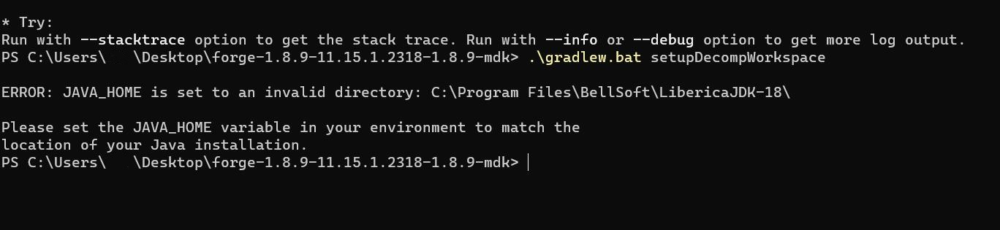
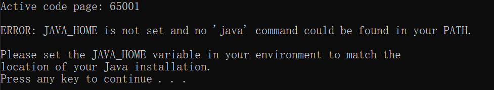
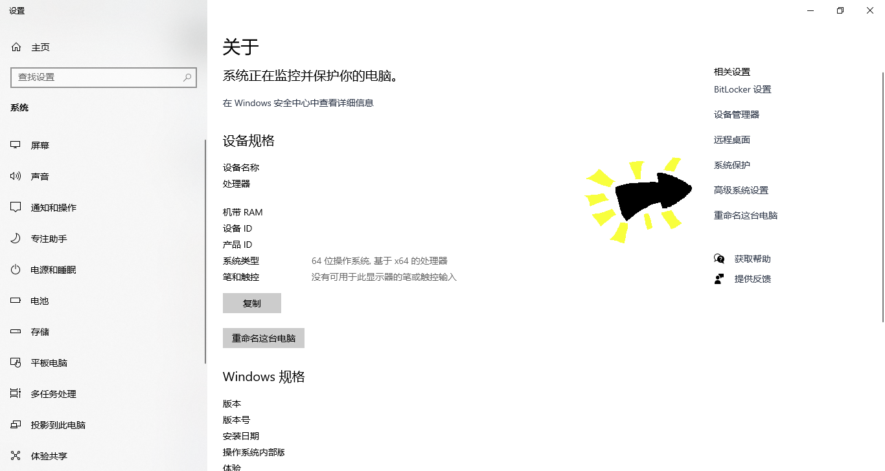
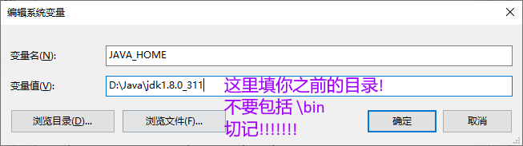

## 常见forge模组开发问题

---

---

### ①JAVA_HOME

这种情况一般是因为环境变量中的**JAVA_HOME**出现了错误,包括且不限于以下情况

* 在设置了**JAVA_HOME**后被后安装的版本覆盖(如本图,选择了JDK18)
* 压根没有设置**JAVA_HOME**
* 在设置了**JAVA_HOME**后没有重启cmd

#### 如何修改呢?

1.找到你的Java目录

 - 结构一般为 ***磁盘符:\目录1\目录2***
 - 不要带结尾的 "***\bin***"!

2.打开你的环境变量设置

 - 右键 **我的电脑** ,点击 **属性**
 - 找到并点击 **高级设置**,在新出来的页面中下拉,并点击 **环境变量**

	- 
	- 

3.设置**JAVA_HOME**

 - 若没有**JAVA_HOME**,请先新建一个
 - 在他对应的变量值中,填写你在步骤1中找到的目录
	- 
	- 请**务必不要**按照本图的变量值去填写你的,**除非你的安装位置和我一模一样**

4.修改**Path**

- (少部分人的**Path**没有问题,就不用设置了)
- 双击点开你的**Path**
  - 
- 删掉其中带有 *java* 的条目
  - 
- 点击右侧新增,分别加入 **%JAVA_HOME%\bin** 和 **%JAVA_HOME%\jre\bin**
  - 

5.重启cmd

 - 很多人在修改完后发现没有起效,原因是没有重启cmd

6.结束

P.S.若不成功请加QQ2524423915找作者问问

